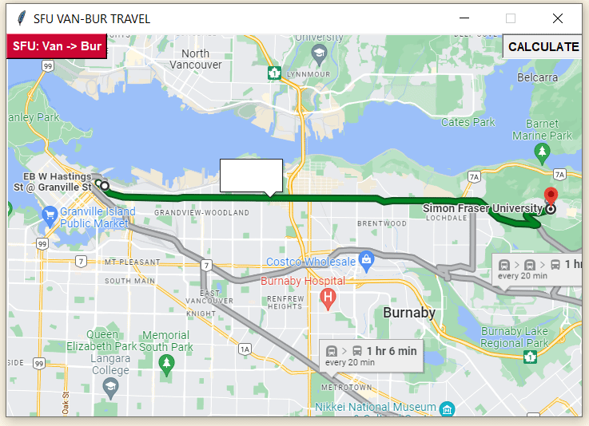

# SFU-campus-time-estimation

We estimated travel time between Burnaby campus and Vancouver campus by using Transit API.

## Dependency

OS: window

Use the package manager [pip](https://pip.pypa.io/en/stable/) to install SFU-campus-time-estimation.

```bash
pip install beautifulsoup4
pip install requests
pip install lxml
pip install Pillow
```

## Usage

```python
import translink_sfu

stop_bay1 = 51861 # SFU Transit Exchange @ Bay 1

translink_sfu.get_data(stop_bay1) # YIELD XML output

translink_sfu.time_to_leave(soup) # YIELD {BUS_NAME,BUS_TIME}
```

If you run `main.py`, you can see:



## Contributors
Abdullah Naeem

Hoyong Jung

Taehyeong Kim

## Limitations of the project
Even though we tried to catch confidence interval for R5, we could not find appropriate data.

So we assumed the data are normal distributed, but it will actually have gamma ditribution.

## License
[MIT](https://choosealicense.com/licenses/mit/)
